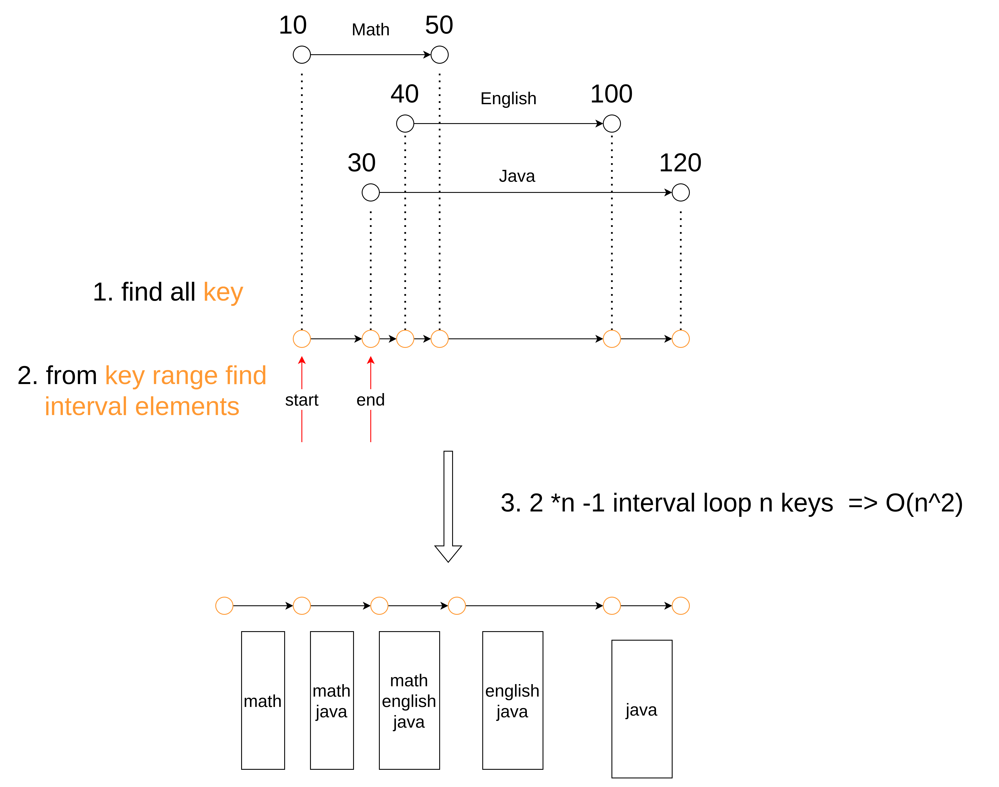

# golang interval test

Test with example case with specific usage case

## problem

data

| start | end | name |
|------|-----|------|
|10  | 50 | "Math" |
|40  | 100 | "English" |
|30  | 120 | "Java"|

turn into

| start | end | names |
|-------|-----|-------|
| 10    | 30  |[ "Math" ]|
| 30    | 40  |[ "Math","Java" ]|
| 40    | 50  |[ "Math", "English", "Java"] |
| 50    | 100 |[ "English" , "Java" ] |
| 100   | 120 |[ "Java" ] |

## my solution

first collection all key ranges

O(n^2)